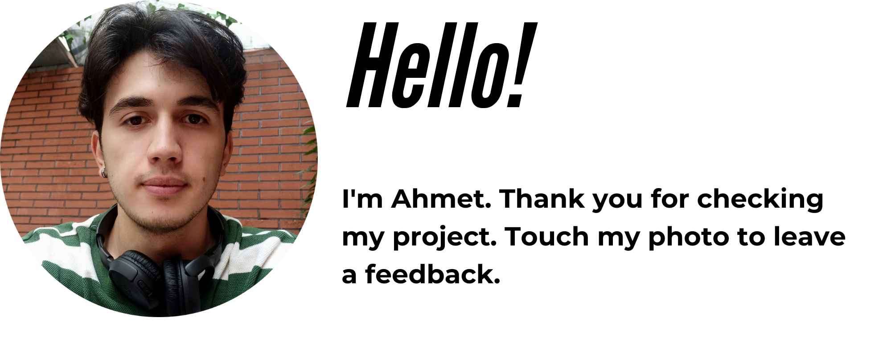

<p align="center">
<a href="https://www.linkedin.com/in/ahmet-ayd%C4%B1n-2583b1199/" target="_blank"></a>
</p>


# Project : Camera Store Website 

## Table of contents

  - [Overview](#overview)
  - [Screenshot](#screenshot)
  - [Project Skeleton](#project-skeleton)
  - [Links](#links)
  - [Built with](#built-with)
  - [Useful resources](#useful-resources)
- [Author](#author)


## Overvire
Project aims to create a responsive camera store website.

## The Challenge

- Your company has recently started on a project that aims to create a parallax website. So you and your colleagues have started to work on the project.

## Project Skeleton 

```

|----resources(folder)
     |----css(folder)
     |----images(folder)  
|----index.html  
|----readme.md
```

## Screenshot
<p align="center">
<a href="https://bavi-boop.github.io/camera_store_responsive_website/"></a>
</p>


## Links

<hr>
<b>Check The Live Website ➡️</b> <a href="https://bavi-boop.github.io/camera_store_responsive_website/">Live Website</a>
<hr>


### Built with

- Semantic HTML5 markup

- CSS custom properties

- Flexbox

- Mobile-first workflow

- [Styled Components](https://styled-components.com/) - For styles
	
- HTML Forms-Input Types 

- HTML Form Elements

- CSS Colors-Border Properties

- CSS Margins-Padding

- CSS Properties for Texts-Font Families-Links

- List Properties

- Overflow Property-The float Property-Opacity / Transparency-Units in CSS


	
-

## Notes

- You can use HTML,and CSS to complete this project.

### Useful resources

- [W3 Schoold](https://www.w3schools.com/) - This helped me for basics of website paradigm. I really liked this pattern and will use it going forward.
- [MDN](https://developer.mozilla.org/en-US/) - This is an amazing document which helped me finally understand deep sides of web development. I'd recommend it to anyone still learning these concepts.


## Author

- Author - [Ahmet]

<center> &#8987; Happy Coding  &#9997; </center>
